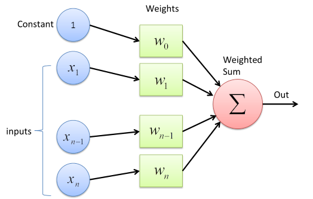
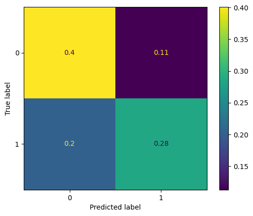

# Machine Learning Labs
Authors: Bastian Krohg & Nicolas Siard
This repo contains 3 submodules with different ML projects from INSA Toulouse

## Lab 1 - Perceptron
- Develop and train a linear perceptron that can be trained using a dataset from the hydrodynamic performance of sailing yachts
- Gradient descent method to train the model by updating the weights according to losses for each iteration

## Lab 2 - MLP (Multi-Layer Perceptron)
- Split data sets, train and tune a multi-layer perceptron

## Lab 3 - Evaluation
- Decision Trees, Evaluation and Confusion Matrix

